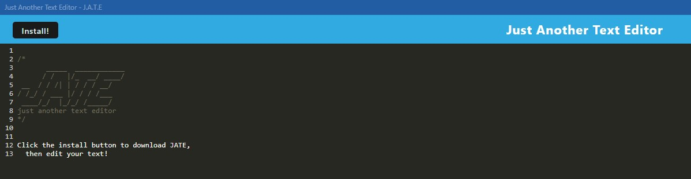

# J.A.T.E - Just Another Text Editor

## Description
This single-page text editor application was created with full PWA capabilities. This project was primarily intended to expand understanding of a webpack build. 

## Installation
This application is no longer deployed via Heroku. For access to full capabilities, the user will have to begin by forking this repo. 

To install this application on the user's local divice, the user can click the install button in their browser.  

## Usage
This application allows the user to enter text onto the screen. This text entry is then saved into the IndexedDB. This application functions offline using a custom service worker. It has built-in fallback options for unreliable connections. 

When testing the J.A.T.E., users should make sure to clear their cache and use a clean browser- a browser in incognito mode works well here. This will ensure that the application is caching accurately. 

## Credits
The starter code for this project was provided by the UT Austin Full-stack Bootcamp. Multiple node packages were utilized in this project, including:
- sequelize
- if-env
- nodemon
- .env
- express 
- babel
- css loader
- webpack
-idb

## License
A [MIT license](https://github.com/aomaits/text-editor/blob/main/LICENSE) was used for this project.
